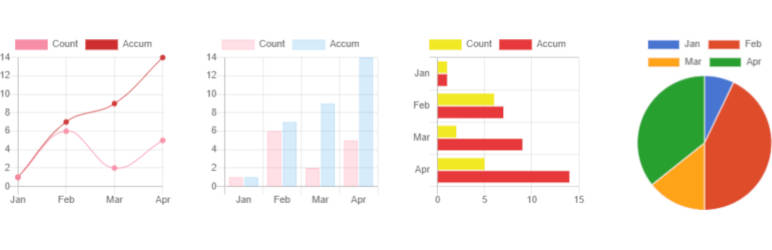
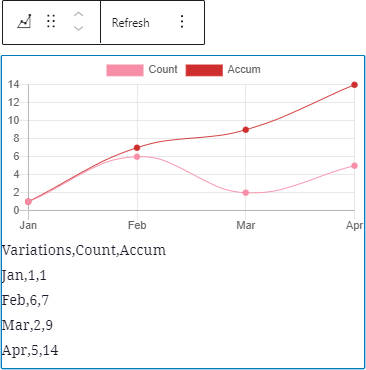
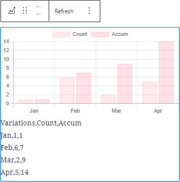
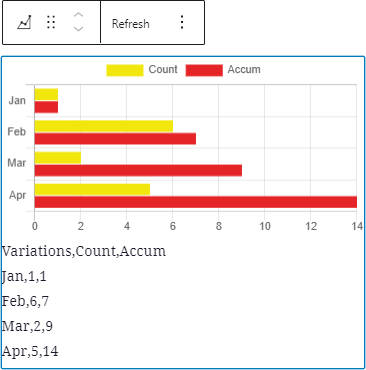
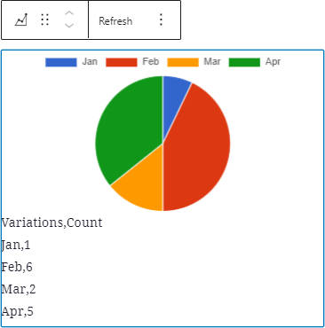
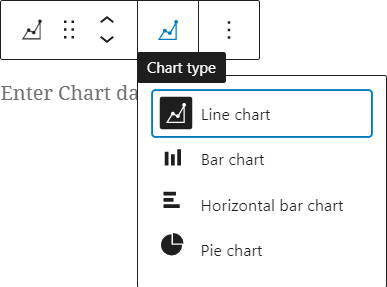

# SB Chart block 

* Contributors:      bobbingwide
* Tags:              block, Chart, Line, Bar, Horizontal bar, Pie, stacked
* Requires at least: 5.6.0
* Tested up to:      6.0.1
* Stable tag:        1.1.0
* Requires PHP:      7.2.0
* License:           GPL-2.0-or-later
* License URI:       https://www.gnu.org/licenses/gpl-2.0.html

Displays a Chart for CSV content.

## Description 
Use the Chart block ( oik-sb/chart ) to display a chart.

## Installation 

1. Upload the plugin files to the `/wp-content/plugins/sb-chart-block` directory, or install the plugin through the WordPress plugins screen directly.
1. Activate the plugin through the 'Plugins' screen in WordPress

OR with the authority to install plugins

1. In the block editor, open the block inserter.
1. Search for the block by typing 'Chart'.
1. Click on the 'Add block' button for the SB Chart block.
1. The SB Chart block plugin will be installed and activated.
1. And the block will be inserted into your content.

## Frequently Asked Questions 
### What types of chart can I display? 

So far...

- Line and stacked line, with optional fill
- Bar and stacked bar
- Horizontal bar and stacked horizontal bar
- Pie

### How do I choose the chart colors? 

There are 6 predefined color palettes:
choose the color palette from a drop down list.

### What options are there? 
Options to control the chart display are:

- Stacked - Toggle on to stack line or bar charts
- Begin Y axis at 0 toggle
- Fill toggle for line charts
- Time line toggle for a date based axis, with selectable Time unit (stepSize)
- Opacity - set the opacity of the background colours.
- Height of the chart, in pixels
- Bar thickness in pixels
- Tension - for curved line charts

### What Chart script does it use?  

v1.1.0 delivers [chartjs v3.9.1](https://github.com/chartjs/Chart.js/releases/tag/v3.9.1)
and [chartjs-adapter-date-fns v2.0.0](https://github.com/chartjs/chartjs-adapter-date-fns)

### What do I need to search for to find the block? 

Chart or SB Chart

### What if my first language is not English? 

If your first language is not English then you could try:

- French - graphique
- German - Diagramm
- Dutch - grafiek
- Italian - grafico
- Spanish - gráfico

### Do I need to build this block? 
No. The plugin is delivered with the production version of the block.
If you do wish to modify the code then you can find instructions in the src folder.

### Are there hooks available for developers?

The following filter hooks are available:

- `sb_chart_block_content`: filter allowing to manipulate the content before it's processed
- `sb_chart_block_options`: filter allowing to add custom Chart.js options

For example, to change the legend font size, use the `sb_chart_block_options` filter in your `functions.php` theme file as follows:

```php
function change_legend_font_size($options, $atts, $series) {
	if (is_object($options)) {
		$custom_options['plugins']['legend']['labels']['font']['size'] = 20;
		$options = (object)array_merge((array)$options, $custom_options);
	}
	
	return $options;
}
add_filter('sb_chart_block_options', 'change_legend_font_size', 10, 3);
```

## Screenshots

1. Line chart with Gutenberg theme colors:  
   
2. Bar chart with Chart theme colors:  
   
3. Horizontal bar chart with Tertiary theme colors:  
   
4. Pie chart with Visualizer theme colors:  
   
5. Chart type toolbar selection:  
   

## Upgrade Notice 
### 1.1.0 
Now uses chart.js v3.9.1. Tested with WordPress 6.0.1 and Gutenberg 13.8.2

## Changelog 
### 1.1.0 
* Changed: Updated wp-scripts #13
* Changed: Put Height and Bar thickness in separate panelbody tags #17
* Changed: Update chart.js to v3.9.1 #11
* Fixed: Fix Fatal on PHP 7.4 Remove default: #11
* Tested: With WordPress 6.0.1 and WordPress Multi Site
* Tested: With Gutenberg 13.8.2
* Tested: With PHP 8.0

