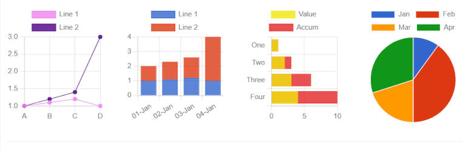

# SB Chart block 

* Contributors:      bobbingwide
* Tags:              block, Chart, Line, Bar, Horizontal bar, Pie, stacked
* Requires at least: 5.6.0
* Tested up to:      6.4-RC1
* Stable tag:        1.2.5
* Requires PHP:      7.2.0
* License:           GPL-2.0-or-later
* License URI:       https://www.gnu.org/licenses/gpl-2.0.html

Displays a Chart for CSV content.

## Description 
Use the Chart block ( oik-sb/chart ) to display a chart.

## Installation 

1. Upload the plugin files to the `/wp-content/plugins/sb-chart-block` directory, or install the plugin through the WordPress plugins screen directly.
1. Activate the plugin through the 'Plugins' screen in WordPress

OR with the authority to install plugins

1. In the block editor, open the block inserter.
1. Search for the block by typing 'Chart'.
1. Click on the 'Add block' button for the SB Chart block.
1. The SB Chart block plugin will be installed and activated.
1. And the block will be inserted into your content.

## Frequently Asked Questions 
# What types of chart can I display? 

So far...

- Line and stacked line, with optional fill
- Bar and stacked bar
- Horizontal bar and stacked horizontal bar
- Pie

# How do I choose the chart colors? 

There are 6 predefined color palettes:
choose the color palette from a drop down list.

Use the Background color overrides and border color overrides fields to set custom color values.

# What options are there? 
Options to control the chart display are:

- Stacked - Toggle on to stack line or bar charts
- Begin Y axis at 0 toggle
- Fill toggle for line charts
- Time line toggle for a date based axis, with selectable Time unit (stepSize)
- Y-axes for multi axis charts
- Color palette dropdown
- Background color overrides. Enter comma separated hex codes.
- Border color overrides. Enter comma separated hex codes.
- Opacity - set the opacity of the background colours.
- Height of the chart, in pixels
- Bar thickness in pixels
- Tension - for curved line charts
- Legend font size
- X-axis font size

# What Chart script does it use?  

v1.2.4 delivers [chartjs v4.3.3](https://cdnjs.com/libraries/Chart.js)
and [chartjs-adapter-date-fns v3.0.0](https://github.com/chartjs/chartjs-adapter-date-fns)

# What do I need to search for to find the block? 

Chart or SB Chart

# What if my first language is not English? 

If your first language is not English then you could try:

- French - graphique
- German - Diagramm
- Dutch - grafiek
- Italian - grafico
- Spanish - gráfico

# Do I need to build this block? 
No. The plugin is delivered with the production version of the block.
If you do wish to modify the code then you can find instructions in the src folder.

### Are there shortcodes available?

Charts can be embedded with the shortcode `chartjs`. The general syntax is as follows:

    [chartjs attribute="attribute value"]CSV content[/chartjs]

Several attributes can be added at the same time. Example:

    [chartjs attribute1="attribute1 value" attribute2="attribute2 value"]CSV content[/chartjs]

Here's the list of supported attributes:

* - `backgroundColors` (string): list of custom background colors (separated by comma) to use for datasets. For example, if there are 3 datasets (`d1`, `d2` and `d3`) and we want `d1` to use the color `#0000FF`, `d2` to use `#FFFF00` and `d3` to use `#008000`, the value of the attribute must be `#0000FF,#FFFF00,#008000`. If some colors are missing (ex.: `#0000FF,,#008000`), default colors from the theme (set with the attribute `theme`) are used as fallback (`#0000FF,second theme color,#008000`); default is no custom colors used
* - `barThickness` (int): thickness (in pixels) of a bar in bar charts; default is the default Chart.js thickness
* - `beginYAxisAt0` (bool): make sure the Y axis begins at 0; default is `false`
* - `borderColors` (string): list of custom border colors (separated by comma) to use for datasets. See the description of the attribute `backgroundColors` for more details; default is the value of the attribute `backgroundColors`
* - `class` (string): class or classes to be added to the chart container; default is an empty string
* - `fill` (bool): fill the area under the line; default is `false`
* - `height` (int): chart height (in pixels); default is the default Chart.js height
* - `indexAxis` (string): axis to use as index; choices are `x`, `y`; note that `y` is automatically used for horizontal bar charts; default is `x`
* - `max` (float): maximum value for Y axes; default is no maximum value
* - `opacity` (float): opacity to apply to the lines or bars; it must be between `0` and `1`; default is `0.8`
* - `showLine` (bool): show (draw) lines; default is `true`
* - `stacked` (bool): enable stacking for line/bar charts; default is `false`
* - `tension` (float): add Bezier curve tension to lines; when set to `0`, lines are straight; default is `0`
* - `theme` (string): theme used for the chart colors; choices are `Chart`, `Gutenberg`, `Rainbow`, `Tertiary`, `Visualizer`, `Wordpress`; default is `Chart`
* - `time` (bool): add support for time line on the X axis; default is `false`
* - `timeUnit` (string): time unit to use if time line is enabled; choices are `year`, `quarter`, `month`, `week`, `day`, `hour`, `minute`, `second`, `millisecond`; default is `hour`
* - `type` (string): type of chart; choices are `bar`, `horizontalbar`, `line`, `pie`; default is `line`
* - `yAxes` (string): list of Y axes to which the datasets are bound. It allows to enable multi-axis charts. For example, if there are 3 datasets (`d1`, `d2` and `d3`) and we want `d1` to use the first Y axis, and `d2` and `d3` to use the second Y axis, the attribute value must be `y,y1,y1`; default is an empty string, so multi-axis feature is disabled and all datasets are automatically bound to the first (and only) Y axis `y`

Here's a fully functional example:

    [chartjs backgroundColors="#008000" fill="true" opacity="0.35" tension="0.2" theme="Visualizer" time="true" timeUnit="month" yAxes="y,y1"]Year,Sales,Expenses
    2020-08,5421.32,1151.21
    2021-02,4823.99,887.23
    2021-03,4945.32,958.00
    2021-10,7086.65,1854.35
    2022-05,7385.21,2009.01
    [/chartjs]

Here's the result:


### Are there hooks available for developers?

The following filter hooks are available:

* - `sb_chart_block_content`: filter allowing to manipulate the content before it's processed
* - `sb_chart_block_options`: filter allowing to add custom Chart.js options

For example, to customize the legend, use the `sb_chart_block_options` filter in your `functions.php` theme file as follows:

```php
function customize_legend($options, $atts, $series) {
	$custom_options = to_array($options);

	$custom_options['plugins']['legend']['labels']['font']['size'] = 16;
	$custom_options['plugins']['legend']['labels']['color'] = '#0000FF';

	return json_decode(json_encode($custom_options));
}
add_filter('sb_chart_block_options', 'customize_legend', 10, 3);

function to_array($data) {
	$array = [];

	if (is_array($data) || is_object($data)) {
		foreach ($data as $key => $value) {
* 			$array[$key] = (is_array($value) || is_object($value)) ? to_array($value) : $value;
		}
	} else {
		$array[] = $data;
	}

	return $array;
}
```

Here's another way (without array conversion):

```php
function customize_legend($options, $atts, $series) {
	if (!isset($options->plugins)) $options->plugins = new stdClass();
	if (!isset($options->plugins->legend)) $options->plugins->legend = new stdClass();
	if (!isset($options->plugins->legend->labels)) $options->plugins->legend->labels = new stdClass();
	if (!isset($options->plugins->legend->labels->font)) $options->plugins->legend->labels->font = new stdClass();

	$options->plugins->legend->labels->font->size = 16;
	$options->plugins->legend->labels->color = '#0000FF';

	return $options;
}
add_filter('sb_chart_block_options', 'customize_legend', 10, 3);
```


## Screenshots 
1. Line chart - Gutenberg theme colors
2. Bar chart - Chart theme colors
3. Horizontal bar chart - Tertiary theme colors
4. Pie chart - Visualizer theme colors
5. Chart type toolbar selection

## Upgrade Notice 
# 1.2.5 
Upgrade for PHP 8.1 and PHP 8.1 support

## Changelog 
# 1.2.5 
* Changed: PHP 8.2 Declare class properties #36
* Tested: With WordPress 6.4-RC1 and WordPress Multisite
* Tested: With PHP 8.1 and PHP 8.2
* Tested: With PHPUnit 9.6
